# Gamle orm

I denna uppgift ska du få koda en enkel prototyp till det klassiska spelet Snake. Du kanske har spelat en modern variant som <a href="http://slither.io/" _target="blank">slither.io</a>. Du kommer inte få koda ett lika häftigt spel där du kan röra dig fritt på skärmen eller spela mot flera olika spelare, istället kommer du få skapa ett spel så som det såg ut på mobiltelefoner i början av 2000-talet. Fokus kommer ligga på att förstå spelmekaniken, det vill säga hur spelet fungerar. För även om det är en ganska enkel logik kan det vara lite klurigt att förstå hur du ska koda det på ett bra sätt.

Här kan du spela två exempel:

* <a href="https://scratch.mit.edu/projects/117494647" target="_blank">Exempel 1</a>

* <a href="https://scratch.mit.edu/projects/119405480/" target="_blank">Exempel 2</a>

## Delmoment 1: En bit av ormen

Du ska få börja med att skapa den sprajten som ormen är uppbyggd av. Du behöver bara rita en väldigt enkel sprajt som du sedan kommer kopiera genom att skapa KLONER.

1.	Skapa ett nytt projekt och ta bort katten.

2.	**Rita en ny sprajt**. Använd **penseln** och **färgburken** för att rita en **fylld fyrkant** som är precis **24 x 24 pixlar**.

  * Använd **förstoringsglaset** för att zooma in: 

  * Varje grå och vit ruta i ritytan är 3 x 3 pixlar, så du ska rita en fyrkant som är **6 x 6 rutor**.

  * Se till att fyrkanten är precis i **centrum av sprajten**.

    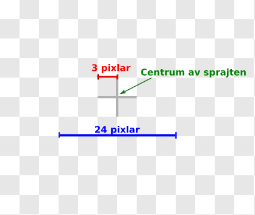

  * Använd **penseln** för att rita en fyrkant som **INTE är ifylld** så att du ser att den är precis i mitten av ritytan. (Rektangelverktyg fungerar inte riktigt bra.)

  

  * Använd sedan **färgburken** för att fylla i fyrkanten

  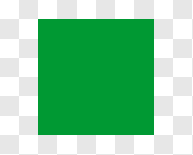

  * Du får välja färg själv!

  * Du kan se hur stor sprajten är genom att titta på klädsel-rutan:

  

  _Så här ska klädsel-rutan se ut. 24 x 24 anger storleken på klädseln._

3. Namnge sprajten **orm**.

> Det kommer bli klart snart varför det är så viktigt hur stor sprajten är.

## Delmoment 2: Spelmekaniken

I det här delmomentet är målet att du ska förstå hur spelet kommer fungera. Det blir inget kodande, utan istället mycket läsande så du kan förstå vad du kommer att koda senare.

* Ormen kommer bestå av flera kopior av den sprajt som du gjorde i delmoment 1. Så här kommer till exempel ormen se ut i början av spelet när den bara består av 3 delar.

  

* Ormen kommer röra sig på skärmen som om det fanns ett rutnät på scenen. För att du enklare ska förstå hur ormen rör sig kommer rutnätet vara utritat i detta delmoment, men det är bara ett hjälpmedel.

  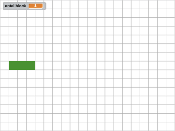

* Varje ruta i rutnätet är 24 x 24 pixlar stor. Det är precis så stor sprajten **orm** är, och därför var det så viktigt att du var noga med hur stor du ritade sprajten.

* Tänk dig nu att ormen består av tre delar och ska röra sig åt höger på skärmen.

   FÖRE:  EFTER:  

* Det är då lätt att tänka att du gör det genom att

  1.	Flyttar första delen ett steg åt höger

  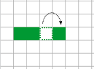

  2.	Flytta andra delen ett steg åt höger

  

  3.	Flytta tredje delen ett steg åt höger

  

* Det är inte så det här spelet kommer fungera, och det är helt enkelt för att det finns en mycket enklare lösning:

  1.	Lägg till en del längst fram på ormen, genom att skapa en nya KLON av sprajten

   

  2.	Radera KLONEN som är längst bak på ormen.

    

Det fiffiga är att du behöver göra samma procedur oberoende hur lång ormen är. För att göra den andra lösningen behöver du flytta lika många delar som ormen består av. Om ormen är 100 delar lång, behöver du flytta 100 kloner! Då är det bättre att skapa en ny och ta bort en annan.

* Denna lösning fungerar också utmärkt när du vill styra ormen i en annan riktning med hjälp av piltangenterna. Det ändå du då måste hålla koll på är var du ska placera den nya klonen.

   _Ormen går uppåt_

  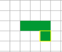 _Ormen går nedåt_

* För att kunna hålla reda på vilken klon som är längst fram och vilken som är längst bak behöver du använda dig av en LOKAL variabel. En LOKAL variabel är som en privat byrålåda som bara kan ses av en sprajt eller en klon. Tänk på den som ett ID-nummer för klonen.

* Klonen längst fram i ormen kommer ha ID-numret 1, och klonen längst bak kommer ha ett ID-nummer som är lika med längden på ormen.

  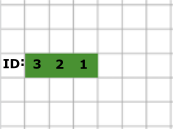

* När ormen rör sig frammåt kommer du behöva uppdatera ID-nummret på klonerna. Den klonen som var "först" kommer ju efter ormen har rört sig vara den "andra" klonen.

  

> Nu bör du förstå tillräckligt mycket av spelmekaniken för att förstå koden du ska skapa.

## Delmoment 3: Starta spelet

I detta delmoment ska du få skapa ett INIT-skript som skapar en orm som är tre delar lång.

Mycket av spelet kommer styras från ett skript för scenen, så se till att **markera scenen** så du kan skapa kod för den.

1.	Skapa en **variabel** som heter **”antal block”**. Det är den som kommer hålla reda på hur många kloner av sprajten **orm** som har skapats.

2.	Skapa **två variabler** som heter **”hx”** och **”hy”**. Dessa två variabler kommer hålla reda på var en ny klon av **orm** kommer placeras, dvs var huvudet kommer att placeras. Dessa behöver inte visas på skärmen.

3.	**Skapa ett nytt block** som du kallar **”initiera orm”**. Du hittar knappen för att skapa nya block under fliken FLER BLOCK.

  
  _Här hittar du knappen för att skapa ett nytt block_

  Detta block kommer sköta alla INITIERING. Egentligen behöver vi inte ett block eftersom koden bara kommer köras en gång. Men skriptet för scenen kommer bli väldigt långt, så genom att skapa detta block blir koden lättare att läsa.

4.	På skriptytan har det nu dykt upp ett block som det står **”definiera (initiera orm)”** på.  Fortsätta på detta skript:

  * **Sätt ”hy”** till **0**

  * **Sätt ”hx”** till **-228**

  * **Sätt ”antal block”** till **0**

  * **Repetera 3** gånger:

    * **Ändra ”antal block”** med **1**

    * **Ändra ”hx”** med **24**

    * **Skicka** meddelandet **”uppdatera”**

    * **Skapa klon** av **orm**

  Startvärdena på **”hy”** och **”hx”** ser till att ormen hamnar i rutsystemet som visades i Delmoment 2. Sedan så skapas 3 kloner av orm och varje ny klon kommer placeras lite längre till höger eftersom **”hx”** ökar.

  **Tips:** Om du vill börja spelet med fler än 3 delar så ändra antalet repetitioner.

  
  _Dessa block behöver du för DEFINITIONEN av **initiera orm**_

5.	Skapa ett **skript för scenen** som säger:

  * Startar när START klickas på

  * **initiera orm**. Du hittar blocket under fliken FLER BLOCK.

  

Nu är det dags att koda lite för ormen:

1.	Gå till ormens skript och **skapa en LOKAL variabel** som heter **"id"**. Var noga med att skapa denna variabel _enbart för denna sprajt_.

  

  _Se till att du kryssar i "enbart för denna sprajt"_

2.	Skapa ett **skript för ormen** som säger

  * Startar när START klickas på

  * **Göm** sprajten

3.	Skapa ett till **skript för ormen** som säger:

  * När jag **startar som klon**

  * **Sätt ”id”** till **1**

  * **Gå till** x: **”hx”** y: **”hy”**

  * **Visa** sprajten

4.	Skapa ett tredje **skript för ormen** som säger:

  * När meddelandet **”uppdatera” tas emot**

  * **Ändra ”id”** med **1**

  

  _Dessa block behöver du för ormens skript_

> Klicka på START! Visas en orm på skärmen som är tre delar lång?

## Delmoment 4: Ormen rör sig

Nu är det dags att få ormen att rör på sig. Kommer du ihåg hur det skulle gå till från Delmoment 2? 1. lägg till en ny klon längst fram och 2. radera klonen längst bak.

1.	Gå till **skriptet för scenen** och placera en **”för alltid”**-loop efter **”initiera orm”**-blocket.

  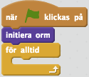

2.	Inuti loopen skapar du följande kod:

  * **Vänta 0.5** sekunder

  * **Ändra ”hx”** med **24**

  * **Skicka** meddelandet **”uppdatera”** _och vänta_. Det är viktigt att vänta här så att alla kloner hinner uppdatera sitt **id** innan programmet kör nästa block.

  * **Skapa klon** av **orm**

  * **Skicka** meddelandet **”radera”** _och vänta_.

  **Tips:** Om du tycker ormen rör sig för snabbt eller för långsamt kan du ändra antalet sekunder i **vänta**-blocket.

3. Skapa ett nytt **skript för orm** som säger:

  * När meddelandet **”radera” tas emot**

  * **Radera klon** OM **”id”** > **”antal block”**

  Eftersom meddelandet **"uppdatera"** skickas innan **"radera"** kommer klonen längst bak ha ett **id** som är större än antalet block.

> Testa spelet! Rör sig ormen framåt åt höger?

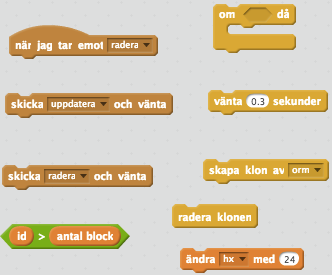

_Dessa block behöver du för punkt 2 och 3. Tänk på att vissa ska användas för **scenen** och andra för **orm**_

## Delmoment 5: Styr ormen

Nu är det dags att få ormen att röra sig på skärmen när du trycker på piltangenterna. Du ska också få koda så att det blir Game Over om ormen åker in i väggen.

1.	Skapa en **variabel** som heter **”riktning”** och som inte behöver visas på skärmen.

  Den här variabeln kommer hålla reda på i vilken riktning som ormen rör sig och kan anta värdena **”höger”**, **”vänster”**, **”uppåt”** eller **”neråt”**

2.	**Sätt ”riktning”** till **”höger”** i _början av spelet_. Gör det genom att lägga blocket i början på **definitionen av ”initiera orm”**.

  

3.	Skapa en **variabel** som heter **”tangent”** och som inte behöver visas på skärmen. Den här variabel kommer hålla reda på _vilken piltangent som var nedtryckt senast_.

4.	**Sätt ”tangent”** till **”höger”** i _början av spelet_.

5.	Skapa ett nytt skript för **scenen** som säger

  * När **”uppåtpil” trycks ned**

  * **Sätt ”tangent”** till **”uppåt”** OM **”riktning”** INTE ÄR **”nedåt”**.

  

  OM-blocket är nödvändigt så att ormen inte kan byta till en riktning som är tvärtemot den riktningen ormen har. När ormen åker uppåt ska den inte kunna byta och åka nedåt, och tvärtom. När den åker  åt höger ska den inte kunna byta och åka till vänster, och tvärtom.

6.	**Skapa tre** liknande **skript** för när **”nedåtpil”**, **”högerpil”** och **”vänsterpil” trycks ned**.

7. **Ändra villkoret** i **OM**-blocket och **värdet** du sätter **”tangent”** till.

8.	I **”för alltid”**-loopen lade du förut ett **”ändra hx med 24”**-block. **Ersätt det blocket** med ett **nytt block** som du kallar **”placera huvud”**.

  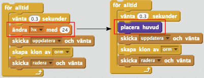

9.	I **definitionen för ”placera huvud"** lägger du följande skript:

  * OM **”tangent”** = **”höger”** : **Ändra ”hx”** med **24**

  * ANNARS:

    * OM **”tangent”** = **”vänster”**: **Ändra ”hx”** med **-24**

    * ANNARS:

      * OM **”tangent”** = **”uppåt”**: **Ändra ”hy”** med **24**

      * ANNARS : **Ändra ”hy”** med **-24**

  * **Sätt ”riktning”** till **”tangent”**

  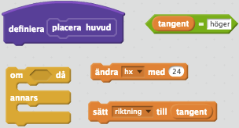

  _Dessa block behöver du för punkt 9. Tänk på att vissa block behöver du använda mer än en gång._

> Testa spelet! Kan du styra ormen med piltangenterna?

Nu kan ormen åka utanför scenen, vilket inte är bra. Därför ska spelet sluta när ormen åker in i väggen.

1.	Fortsätt på **definitionen för "placera huvud"** med följande skript

  * OM **”hx” < -228** ELLER **”hx” > 228** ELLER **”hy” < -168** ELLER **”hy” > 168**

    * **Skicka** meddelandet **”game over”** _och vänta_

    * **Stoppa alla** skript

2.	Skapa ett nytt **skript** för **ormen** som säger:

  * När jag **tar emot ”game over”**

  * **Säg** _”Neeej!”_ i 2 sek OM **”id”** = 1

  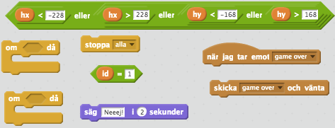

  _Dessa block behöver du för koden ovan. Tänk på att vissa block behövs för **scenen** och andra för **ormen**_

> Testa spelet igen! Vad händer om du åker in i kanten på scenen?

## Delmoment 6: Mat

Det som fattas i spelet är mat, vilket ormen ska äta för att bli längre. Nu ska du få koda det. Maten ska vara i form av runda kulor som placeras ut slumpmässigt på skärmen.

1.	**Rita en ny sprajt**. Använd **cirkelverktyget** för att rita en **ifylld cirkel** som är cirka **16 x 16** pixlar stor.

  * Använd **förstoringsglaset** för att **zooma** in

  * **Rita en cirkel** som är ungefär **4 x 4 rutor**

  * Se till att cirkeln är precis i **centrum av sprajten**

  * Du får välja färg själv!

  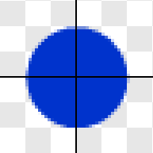

  _Ungefär så här ska sprajten se ut när du ritat den. Korset visar centrum för sprajten_

2.	**Namnge** sprajten **mat**

  

Nu är det dags att placera ut maten på skärmen. Detta ska göras från **”för alltid”**-loopen i skriptet för **scenen**, där koden för att flytta ormen också finns.

* Om du skulle lägga in ett **”skapa klon av”**-block direkt i loopen skulle en kula mat dyka upp varje gång ormen rör på sig. Då skulle det bli väldigt mycket mat och skärmen skulle ganska fort bli full.

* I stället så ska du bara placera ut **mat var 10:e gång** du flyttar ormen. Det kan du göra genom att använda en **variabel** och ett **OM**-block.

Gå till scenen så att du ser koden du skapade tidigare

1.	Skapa en **variabel** som heter **”ny mat”** som inte behöver visa på skärmen.

2.	**Sätt ”ny mat”** till **0** i _början av spelet_. (Använd **definitionen av ”initiera orm”**).

3.	**Sist** i **”för alltid”**-loopen lägger du ett **nytt block** som heter **”skapa mat”**

  

4.	I **definitionen för ”skapa mat”** lägger du följande skript:

  * **Ändra ”ny mat”** med **1**

  * OM **”ny mat” = 10**:

    * **Sätt ”ny mat”** till **0**

    * **Skapa klon** av sprajten **mat**

  **Tips:** Om du vill att det ska skapas mat oftare kan du ändra 10 till ett lägre tal.

  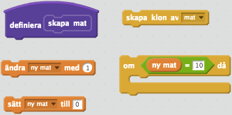

  _Dessa block behöver du för definitionen av "skapa mat"_

5.	Skapa ett **skript** för **mat** som säger:

  * När START klickas på

  * **Göm** sprajten

6.	Skapa ett andra **skript** för **mat** som säger:

  * När jag **startar som klon**

  * **Sätt x** till (24 * slumptal mellan 0 och 19) - 228

  * **Sätt y** till (24 * slumptal mellan 0 och 14) - 168

  * **Visa** sprajten

  

  _Så här bör koden ovan se ut_

Scenen är 480 pixlar bred och 360 pixlar hög, vilket gör att det får plats 20 delar av ormen på bredden och 15 delar på höjden (räkna efter antalet rutor i rutsystemet som visades i Delmoment 2 om du vill kolla!). Därför skapar koden ett slumptal mellan 0 och 19, vilket väljer en av rutorna på bredden. Genom att multiplicera 24 och sedan dra ifrån 228 ser koden till att maten hamnar i mitten av varje ruta. Samma logik används för att placera ut maten på höjden.

> Testa koden! Placeras det ut mat i mitten på scenen?

Nu kan det hända att en klon av mat placeras ut där ormen är, vilket är fel. Mat ska bara placeras ut på tomma rutor. Det ska du fixa nu.

1.	**Fortsätt** på koden som körs **när mat startar som klon**:

  * OM **rör** sprajten **orm**

    * **Skapa klon** av mig själv

    * **Radera klonen**

  

  _Här ska du placera koden ovan. **"visa"**-blocket skapde du tidigare._

Till sist ska du koda så att ormen växer när den äter mat

1.	Skapa en **variabel** som heter **”växa”** som inte behöver visas på skärmen

2.	**Sätt ”växa”** till **”nej”** i _början av spelet_.

3.	**Fortsätt** på koden som körs när **mat startar som klon**:

  * För alltid:

    * OM **rör** sprajten **orm**:

      * **Sätt ”växa”** till **”ja”**

      * **Radera klonen**

  

  _Dessa block behöver du för koden. Tänk på att du lägger koden direkt efter OM-blocket du skapade tidigare._

4.	Gå till **skriptet** för **scenen** och **”för alltid”**-loopen. Ersätt **”skicka radera och vänta”**-blocket med följande kod

  * OM **”växa” = ”ja”**

    * **Ändra ”antal block”** med **1**

    * **Sätt ”växa”** till **”nej”**

  * ANNARS:

    * **Skicka ”radera”** och _vänta_

     

  _Bilden visar vilken kod du ska byta ut mot koden i punkt 4._

> Testa spelet igen! Blir ormen längre när den äter mat?

## Färdig!
Grattis, nu har du gjort klart uppgiften.

**Glöm inte att spara ditt projekt!** Döp det gärna till uppgiftens namn så att du enkelt kan hitta den igen.

> **Testa ditt projekt**  
  Visa gärna någon det som du har gjort och låt dem testa. Tryck på DELA för att andra ska kunna hitta spelet på Scratch. Gå ut till projektsidan och låt någon annan testa spelet!

## Utmaningar

### Klädsel för huvud

För tillfället ser alla delar av ormen likadana ut. Det blir roligare om ormens huvud har ett eget utseende. Det kan du skapa genom att göra en ny klädsel för ormen. Rita till exempel en tunga och ett par ögon.

**Obs!** Se till att huvudet pekar åt höger

  

_Så här kan ormhuvudet se ut_

Gör sedan två ändringar i scripten för ormen.

1.	När den **startar som klon** ska **klädseln ändras** så att den klonen visar huvudet. Du får också se till att **huvudet pekar i rätt riktning**.

2.	När ormen tar emot **"uppdatera"** får du **ändra klädseln** så att klonen visar rätt klädsel.

### Kollision med sig själv

Se till att det blir Game Over om ormen åker in i sig själv. Då får du skapa en **”för-alltid”** loop när **orm startar som klon** och kolla efter en **kollision med sig själv**.

**Obs!** Du får kolla efter en kollision med hjälp av färg.

### Gå igenom väggar

Ett alternativ till att det blir Game Over när ormen åker in i väggen är att ormen kommer ut på motsatt sida av scenen. Om den till exempel åker in i väggen på höger sida kommer huvudet ut på den vänstra sidan av scenen.

**Tips:** Ändra i koden för **definitionen av ”placera huvud”**.

### Olika sorters mat

Du kan skapa mer än en typ av mat genom att rita flera klädslar för sprajten mat. Du kan till exempel koda så att ormen växer med två delar om den äter en röd triangel!

**Tips:** Sätt variabeln **"växa"** inte bara till "ja" eller "nej".

### Snabbare orm

Du kan koda så att ormen rör sig snabbare när den blir längre. I **"för alltid"**-loopen ligger en det ett **”vänta”**-block. Skapa en variabel som håller reda på hur länge koden ska vänta i början av loopen. Ändra sedan variabel när ormen har blivit längre.

> Du kan titta på ett exempel spel där alla dessa utmaningar är kodade. <a href="https://scratch.mit.edu/projects/119405480/" target="_blank">Gå till spelet.</a>

## Frågeställningar

* Vad är en lokal variabel?

* Hur skapar du ett nytt block?

* Varför kan det vara bra att skapa ett nytt block?
